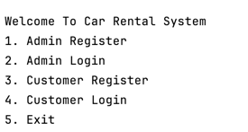
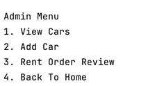
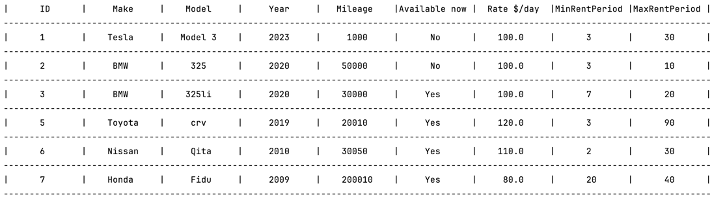
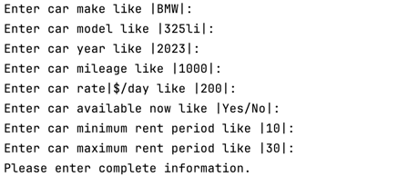
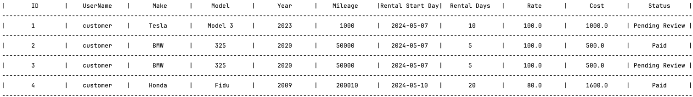
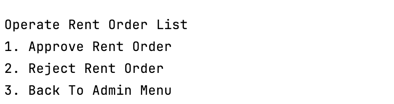
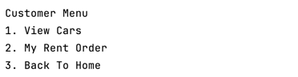
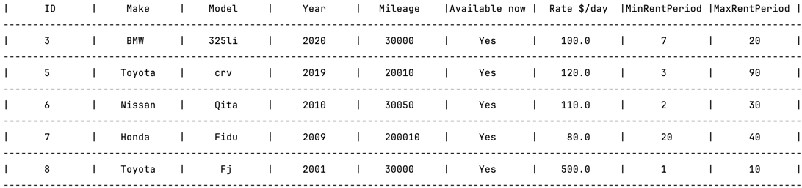
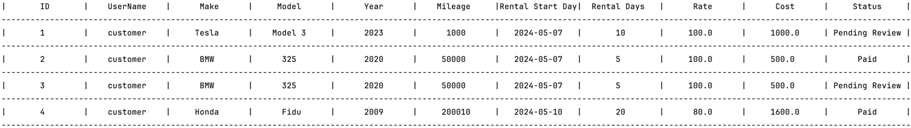

## Car_Rental_System

### Description:
> This is a car rental system based on CUI. Administrators can manage vehicles through the backend, and customers can view currently available vehicles and select vehicles for rental. Customers can also choose the rental time and duration.

### Programming Language:
> Python

### Database:
>SQLite

### Version Control:
>Git

### Module Description：

#### 1.view module
>The entry class for the program is typically referred to as the "main class"
#### 2.manager module
>The layer responsible for the logic processing of the program is commonly referred to as the "business logic layer" 
#### 3.dao module
>The layer responsible for managing objects and database operations is commonly referred to as the "data access layer"

### How To Usage
#### Run the application:

```python 
python index.py
```
#### Account
> Admin Account:
> 1. account number: admin1 | password: 123456
> 2. account number: admin2 | password: 123456
> 
> Customer Account:
> 1. account number: customer1 | password: 123456

#### Admin operation steps
> 
> 1. admin user can choose Admin Register or Admin Login
> 2. if admin user login
> 
> 
> 1. if admin user View Cars 
> 
> 
> 1.1 admin user can Edit Car or Delete Car
> 
> 
> 2. if admin user Add Car
> 
> 
> 3. if admin user Rent Order Review
> 
> 
> 3.1 if the order status equal Pending Review, admin user can Approve Rent Order or Reject Rent Order
>
> 

#### Customer operation steps
> 
> 
> 1. customer can choose Customer Register or Customer Login
> 2. if customer login
> 
> 
> 
> 1. if customer View Cars (customer only can view Available now equal Yes)
> 
>
> 1.1 customer can Rent A Car
> 
> 
> 
> 1.2 if customer Rent A Car
>   
> 2. if customer select My Rent Order
>   
> 
>
> 2.1 customer can view all customer's rent oders
> 
> 
> 2.2 customer can Pay Rent Order
> 
> 
>

### About the Feature

Our car rental system has fully encapsulated the core interfaces and functionalities. This means that users can easily interact with the system whether it's through a Command-Line Interface (CLI) or a Graphical User Interface (GUI).

This encapsulation brings several advantages:

- **Flexibility and Scalability:** Encapsulation of core functionalities makes the system more flexible and scalable. We can seamlessly switch between interaction modes, from CLI to GUI, without needing to modify the core functionalities.
  
- **Cost-Effectiveness:** With the core functionalities already encapsulated, future development efforts can focus solely on designing and optimizing the interface, significantly saving on development costs and time.
  
- **Enhanced User Experience:** Users can choose the interaction mode that best suits their preferences and habits, thereby enhancing user experience and satisfaction.

This approach allows our car rental system to operate flexibly in different environments and scenarios, providing users with consistent, high-quality service.


